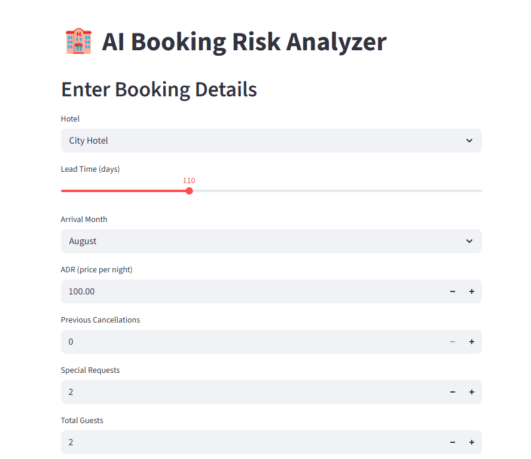
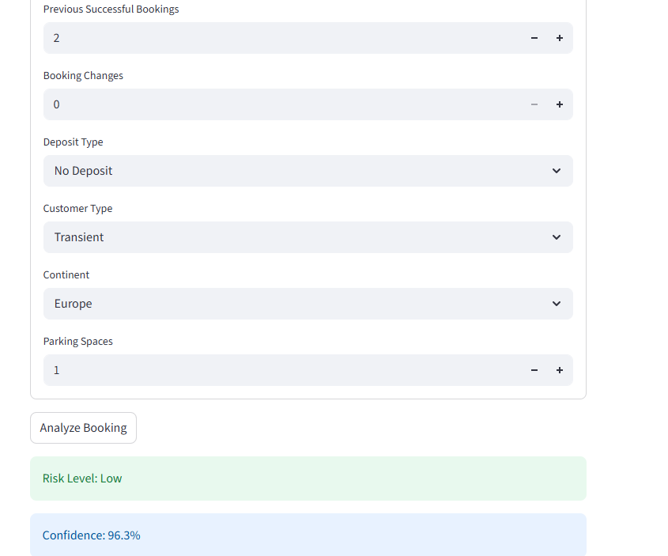
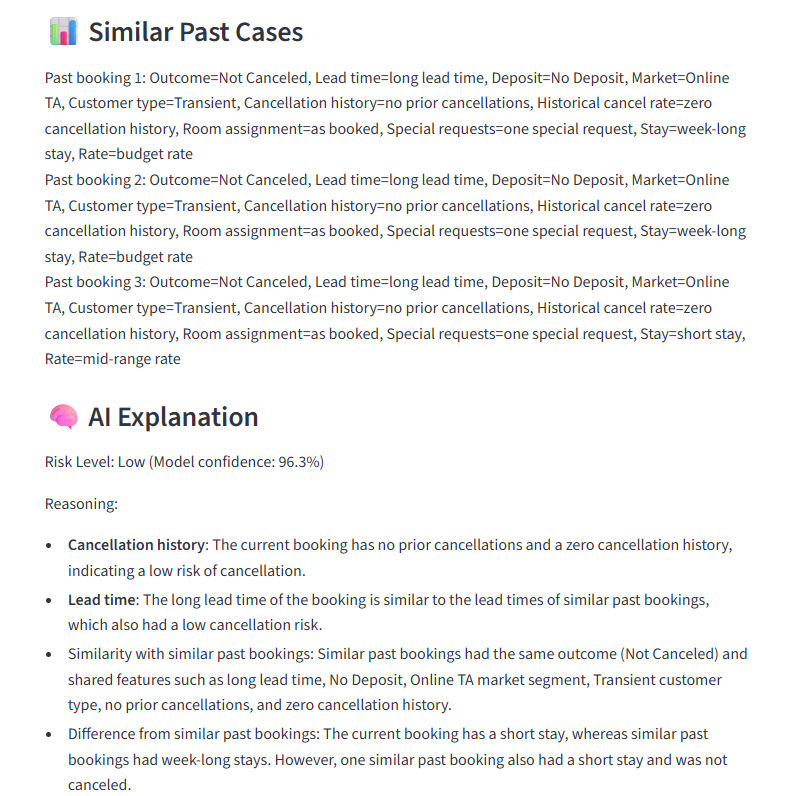
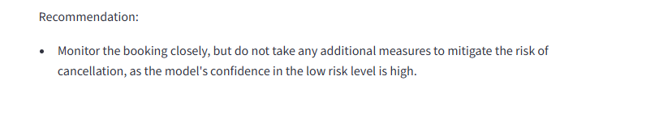

# 🏨 AI-Powered Booking Risk Decision Support System

An end-to-end AI system that predicts hotel booking cancellation risk and provides human-like explanations using a hybrid approach combining Machine Learning and Retrieval-Augmented Generation (RAG).

---

## 🚀 Project Overview

Traditional machine learning models provide predictions but lack interpretability. This project goes beyond prediction by building a decision support system that answers:

- ❓ Will a booking be canceled?
- ❓ Why is it risky?
- ❓ What similar past cases support this?
- ❓ What action should be taken?

---

## 🧠 System Architecture

```
Frontend (Streamlit)
        ↓
Backend API (FastAPI)
        ↓
ML Model (Random Forest) + Prompt Chain (LangChain)
        ↓
Vector DB (Pinecone, queried directly) + LLM (Groq)
```

### Internal Pipeline

```
 Input booking dict
         │
         ▼
┌─────────────────────────────────────────┐
│  STEP 1 — predict_risk()                │
│  Random Forest → Low / Medium / High    │
└───────────────────┬─────────────────────┘
                    │
         risk_level drives what comes next
                    │
          ┌─────────┴──────────┐
          │                    │
          ▼                    ▼
┌──────────────────┐  ┌─────────────────────────┐
│  STEP 2A         │  │  STEP 2B                │
│  Retrieve        │  │  Build LLM summary      │
│  similar past    │  │                         │
│  bookings from   │  │  Convert booking fields │
│  Pinecone        │  │  into category labels   │
│                  │  │  (no raw numbers)       │
│                  │  └───────────┬─────────────┘
│                  │              │
│                  │              │
│                  │              │
│                  │              │
└────────┬─────────┘              │
         │                        │
         │  past cases            │  current booking
         │  (category labels)     │  (category labels)
         └──────────┬─────────────┘
                    │
                    ▼
┌─────────────────────────────────────────┐
│  STEP 3 — explanation_prompt            │
│  Groq LLaMA 3.1 8B                     │
│  Reasons using feature importance order │
│  Outputs: risk level + recommendation   │
└───────────────────┬─────────────────────┘
                    │
                    ▼
             analysis dict
```

> 📖 Each step explained in detail:
> - **Step 1** → [Model-Driven Risk Thresholds](#-model-driven-risk-thresholds)
> - **Step 2A** → [Handling Evidence Conflict in RAG](#-handling-evidence-conflict-in-rag-key-innovation) · [Improved RAG Retrieval](#-improved-rag-retrieval) · [Step-by-Step: How Retrieval Works](#-step-by-step-how-retrieval-works)
> - **Step 2B** → [Feature Categorization](#-feature-categorization) · [What Gets Embedded vs. What Gets Stored](#-what-gets-embedded-vs-what-gets-stored-in-pinecone)
> - **Step 3** → [Prompt Engineering](#-prompt-engineering)

---

## 🔍 Features

- 📊 Booking cancellation prediction (Random Forest)
- 🔎 Similar case retrieval using vector search (RAG)
- 🧠 AI-generated explanations using LLM
- 🎯 Risk classification (Low / Medium / High)
- 💬 Structured reasoning + recommendation
- 🌐 Interactive UI for real-time analysis

---

## 🛠️ Tech Stack

### Backend
- **FastAPI** – API development
- **Pydantic** – Data validation

### Frontend
- **Streamlit** – Interactive UI

### Machine Learning
- **Scikit-learn** (Random Forest)

### AI / GenAI
- **LangChain** – Prompt chaining (NOT retrieval)
- **Hugging Face** (sentence-transformers) – Embeddings
- **Pinecone** – Vector database
- **Groq LLM** – Explanation generation

---

## 💡 Key Design Decisions

### 🔸 Feature Categorization

Converted raw numerical values into semantic categories before passing anything to the LLM:

| Feature | Raw value | Category label |
|---|---|---|
| `lead_time` | `150` | `long lead time` |
| `adr` | `92.5` | `budget rate` |
| `total_stay` | `2` | `short stay` |
| `previous_cancellations` | `1` | `one prior cancellation` |
| `total_of_special_requests` | `3` | `several special requests` |
| `cancel_ratio` | `0.67` | `moderate historical cancellation rate` |

This improved reasoning quality and similarity matching, and eliminated a class of LLM errors where raw numbers were leaked or misinterpreted.

### 🔸 Model-Driven Risk Thresholds

Used Random Forest probability outputs to define three classes:

| Label | Cancellation probability | Meaning |
|---|---|---|
| `Low` | < 40% | Booking is likely to be honoured |
| `Medium` | 40% – 70% | Uncertain — monitor closely |
| `High` | ≥ 70% | Booking is likely to cancel |

This avoided rigid rule-based thresholds.

### 🔸 Handling Evidence Conflict in RAG (Key Innovation)

In similarity-based retrieval, bookings with similar features can have different outcomes (some canceled, some not). This created a critical issue:

- Retrieved cases sometimes contradicted the model's prediction
- Leading to inconsistent and confusing explanations

```
Standard retrieval (the problem):

Booking features  →  retrieve top-5 similar cases
                           │
                    ┌──────┴──────┐
                    │             │
               Canceled      Not Canceled
               (2 cases)     (3 cases)
                    │             │
                    └──────┬──────┘
                           │
                    LLM sees mixed evidence
                           │
                    "Model says High Risk,
                     but 3 similar bookings
                     did NOT cancel..." ← CONTRADICTION
```

**👉 Solution: Outcome-Conditional Retrieval**

Retrieval is conditioned on the predicted outcome so the LLM always receives evidence consistent with the model's decision:

```
predict_risk()  ──►  "High"
                        │
                        ▼
              Apply Pinecone metadata filter:
              { "is_canceled": { "$eq": 1 } }
                        │
                        ▼
              Top-5 similar cases, ALL canceled
                        │
                        ▼
              LLM receives coherent evidence:
              "Similar bookings with these features
               DID cancel — here is why this one
               is also High Risk."
```

The key architectural insight is that **prediction must happen before retrieval** — the retrieved evidence is selected to support the model's conclusion, not contradict it.

**The 3-Tier Retrieval Strategy:**

```
┌─────────────────────────────────────────────────────────────┐
│  TIER 1 — Outcome-Filtered Query  (primary)                 │
│                                                             │
│  High Risk  →  filter: is_canceled == 1                     │
│  Low Risk   →  filter: is_canceled == 0                     │
│  Medium     →  no filter  (mixed context is appropriate)    │
│                                                             │
│  Requires: ≥ 2 results above cosine threshold (0.65)        │
└──────────────────────┬──────────────────────────────────────┘
                       │ < 2 results? → escalate to Tier 2
                       ▼
┌─────────────────────────────────────────────────────────────┐
│  TIER 2 — Unfiltered Fallback                               │
│                                                             │
│  Drops the outcome filter. Returns the closest neighbors    │
│  regardless of cancellation outcome.                        │
│  Triggered when outcome-matching cases are sparse in DB.    │
└──────────────────────┬──────────────────────────────────────┘
                       │ 0 results after fallback? → escalate to Tier 3
                       ▼
┌─────────────────────────────────────────────────────────────┐
│  TIER 3 — ML-Only Explanation                               │
│                                                             │
│  No retrieved cases at all. Returns a graceful fallback:    │
│  "Risk determined solely by the trained ML model.           │
│   Review this booking manually."                            │
└─────────────────────────────────────────────────────────────┘
```

**Result:**
- ✅ More reliable explanations
- ✅ Better alignment between ML predictions and LLM reasoning
- ✅ Improved trust in the system

### 🔸 What Gets Embedded vs. What Gets Stored in Pinecone

Two separate representations of each booking are maintained in the vector database:

| Layer | Content | Purpose |
|---|---|---|
| **Vector (embedding)** | Categorized text built by `convert_features_to_text()` | Drives similarity search — semantic matching, not numeric distance |
| **Metadata** | Raw field values (`lead_time`, `adr`, `is_canceled`, etc.) | Used for outcome filtering, lead-time proximity filtering, and future analysis |

The embedding text looks like this:
```
"Hotel booking case. This booking has long lead time, budget rate, and a short stay.
There are 2 guests. The booking has no special requests, two prior cancellations,
no booking changes, not on waiting list, and moderate historical cancellation rate.
Deposit type is No Deposit. Market segment is Online TA. Customer type is Transient.
Guest region is Europe. The case has room type changed. Final outcome: Canceled."
```

This separation means:
- Similarity search operates on **human-readable semantic categories**, not raw numbers — improving match quality
- Raw values are preserved in metadata so the system can apply **outcome filtering** and **lead-time proximity filtering** at query time without re-embedding
- The metadata also serves as a record for **future auditing or retraining** without needing to re-ingest

### 🔸 Improved RAG Retrieval

Three filters are applied on top of vector similarity to ensure only high-quality, relevant cases reach the LLM:

**Cosine similarity threshold (≥ 0.65)** — Drops any retrieved case below this score, ensuring only genuinely similar bookings reach the LLM.

**Lead-time proximity filter (±60 days)** — A booking made 300 days out behaves very differently from one made 5 days out, even if all other features match. Only cases within 60 days of the current booking's lead time are kept, with a safe fallback to unfiltered results if the filter is too strict.

**Server-side metadata filtering (outcome filter)** — Instead of filtering results in Python after retrieval, `index.query()` applies the `is_canceled` condition inside Pinecone directly, guaranteeing every returned case already matches the predicted outcome.

### 🔸 Step-by-Step: How Retrieval Works

```
1. convert_features_to_text()
   Booking fields → categorized sentence
   e.g. "long lead time, budget rate, two prior cancellations..."
                │
                ▼
2. _embed()
   Sentence → 384-dim vector
   (sentence-transformers/all-MiniLM-L6-v2)
                │
                ▼
3. Outcome filter decided from predicted risk
   High   → is_canceled == 1
   Low    → is_canceled == 0
   Medium → no filter
                │
                ▼
┌─────────────────────────────────────────────────┐
│  TIER 1 — Outcome-filtered query                │
│                                                 │
│  index.query(vector, filter=outcome_filter)     │
│  → top-5 similar cases matching predicted       │
│    outcome returned from Pinecone               │
│  → score threshold (≥ 0.65) applied             │
│  → lead-time proximity filter (±60 days) applied│
│                                                 │
│  Need ≥ 2 results to proceed                    │
└──────────────────────┬──────────────────────────┘
                       │ < 2 results?
                       ▼
┌─────────────────────────────────────────────────┐
│  TIER 2 — Unfiltered fallback                   │
│                                                 │
│  index.query(vector)  ← no outcome filter       │
│  → same score + lead-time filters applied       │
└──────────────────────┬──────────────────────────┘
                       │ 0 results?
                       ▼
┌─────────────────────────────────────────────────┐
│  TIER 3 — ML-only explanation                   │
│                                                 │
│  No cases retrieved. LLM comparison skipped.    │
│  Returns: "Risk determined by ML model only."   │
└──────────────────────┬──────────────────────────┘
                       │ cases retrieved (Tier 1 or 2)
                       ▼
4. format_matches()
   Retrieved cases that passed all filters
   are formatted using category labels from metadata
   (raw numbers never reach the LLM)
```

### 🔸 Prompt Engineering

- Enforced category-based comparisons (no raw numbers allowed)
- Defined explicit feature importance order for reasoning (cancellation history → lead time → deposit → … → special requests)
- Structured output format (reasoning bullets + one recommendation)
- LLM required to state at least one similarity AND one difference vs. past bookings

This improved consistency and interpretability of LLM responses.

---

## ⚠️ Challenges & Solutions

| Challenge | Solution |
|---|---|
| API connection issues | Proper port management & parallel service execution |
| Noisy RAG retrieval | Added filtering + score thresholds |
| Poor LLM explanations | Introduced feature categorization + prompt tuning |
| Evidence conflict in RAG | Outcome-conditional retrieval (Tier 1 → 2 → 3) |
| Raw numbers leaking to LLM | Separated `build_llm_booking_summary()` from UI display text |
| System instability | Debugged components independently |

---

## ▶️ How to Run the Project

### 🔹 1. Clone the repository

```bash
git clone <your-repo-link>
cd AI_DecisionSupportSystem_for_BookingRisk
```

### 🔹 2. Activate virtual environment

```bash
.venv\Scripts\Activate
```

### 🔹 3. Configure environment variables

Create a `.env` file in the root directory:

```env
PINECONE_API_KEY=your_pinecone_key
GROQ_API_KEY=your_groq_key
```

### 🔹 4. Prepare vector database (IMPORTANT)

```bash
python backend/ingest.py
```

This uploads booking cases into Pinecone. Must be run before starting the backend.

### 🔹 5. Run Backend (FastAPI)

```bash
python -m uvicorn backend.main:app --reload --port 8000
```

Open in browser: http://127.0.0.1:8000/docs

### 🔹 6. Run Frontend (Streamlit)

```bash
streamlit run frontend/app.py
```

Open in browser: http://localhost:8501

---

### Retrieval Mode Reference

| Value | Meaning |
|---|---|
| `outcome-aligned` | Tier 1 succeeded — retrieved cases match predicted outcome |
| `fallback-unfiltered` | Tier 2 triggered — not enough outcome-matching cases in DB |
| `medium-unfiltered` | Medium risk — intentionally mixed retrieval |
| `none` | Tier 3 — no usable matches, ML-only explanation returned |

---

## 🎯 Key Takeaways

- Built a hybrid ML + RAG decision support system from end to end
- Designed outcome-aligned retrieval to eliminate evidence conflict between ML predictions and LLM reasoning
- Improved LLM explanation quality using feature categorization instead of raw numerical inputs
- Developed a full-stack AI application with a production-style architecture (FastAPI + Streamlit)

---

## 📸 Demo




